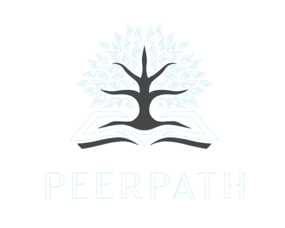
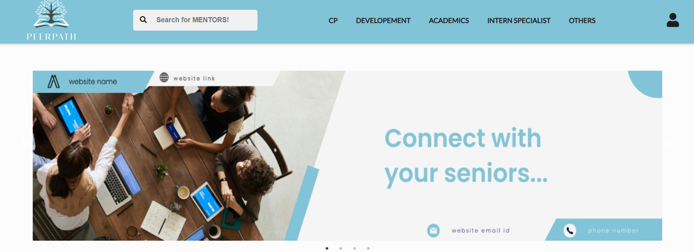
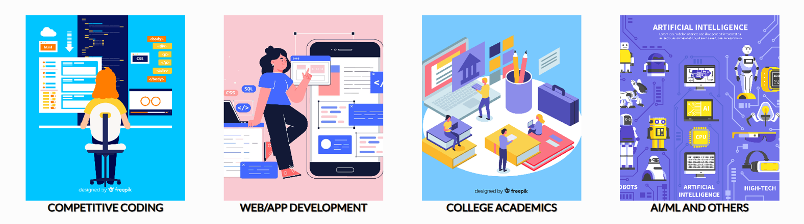
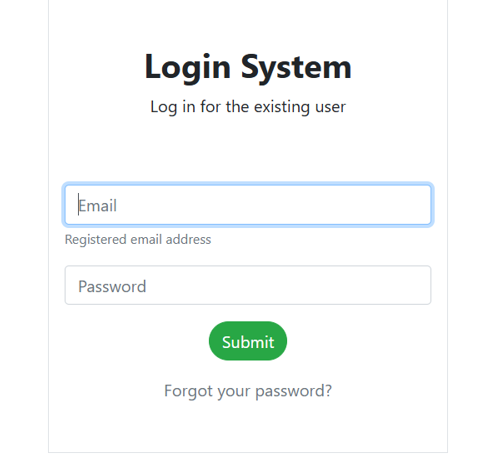
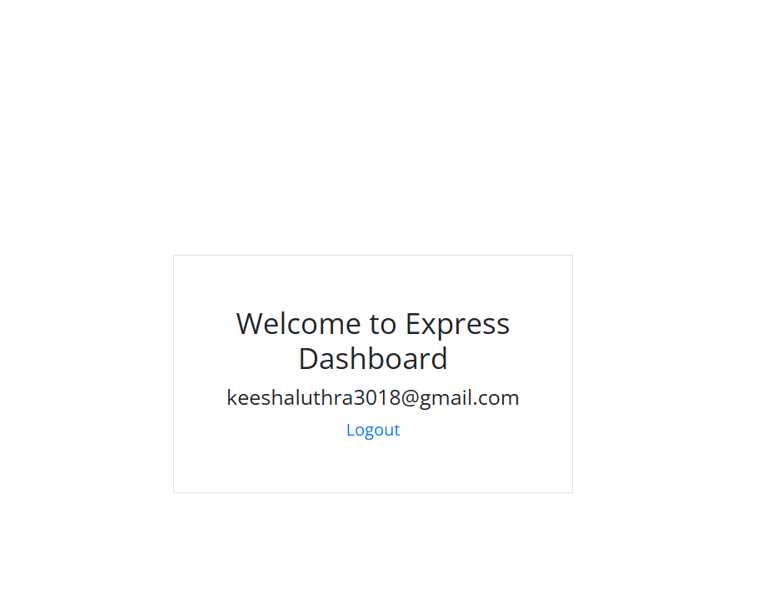

<div align="center">
  <!-- TODO: Provide path to your project's logo below -->
  

  # PeerPath
  
  **A dynamic mentoring platform connecting students with experienced mentors across disciplines.**

  [**🚀 View Live Demo**](https://peerpath-mentorship-platform.onrender.com/)

  [](https://nodejs.org)
  [](https://expressjs.com/)
  [](https://www.mongodb.com/)
  [](LICENSE)

  <br />

  

</div>

---

## 🌍 Project Overview

**PeerPath** bridges the gap between eager learners and experienced mentors. It consolidates the discovery of mentors across various academic and professional tracks—ranging from Competitive Programming and Web Development to College Academics and AI/ML—into one seamless web experience.

Originally conceptualized as a static site, PeerPath has been architecturally upgraded into a **production-ready Node.js application**. It now boasts clean repository organization, strict environment configuration, robust backend API routing, and safe authentication mechanics.

---

## ✨ Key Features

*   👩‍🏫 **Mentor Discovery:** Browse over 20 dedicated mentor profile pages categorized by specialization (e.g., CP, Dev, Internships).
*   📱 **Responsive UI:** A fluid design offering dynamic component injection and sleek carousels using Slick.
*   🚀 **Production-Ready Backend:** A hardened Node.js Express server handling authentication and database integration.
*   🛡️ **Secure Authentication:** Session-based user authentication, password hashing, and secure password reset workflows via Nodemailer.
*   📊 **Dashboard Access:** Personalized user dashboards available upon successful login.

---

## 🏗️ Architecture

PeerPath utilizes a robust Node.js backend to support its interactive, component-injected frontend.

```text
PeerPath/
├── backend/
│   └── app/
│       ├── .env               # Environment configurations
│       ├── package.json       # Backend dependencies
│       ├── server.js          # Main Express server and API routes
│       └── views/             # EJS templates for secure authentication flows
├── frontend/
│   ├── css/                   # Vanilla stylesheets
│   ├── html/                  # UI views and injectible HTML fragments
│   ├── img/                   # Static application images
│   └── js/                    # Client-side interactions
└── screenshots/               # Application media and galleries
```

### Request Flow
`Client` ➡️ `Static Frontend Server (Port 8080)`  
`Authentication` ➡️ `Express API (Port 3000)` ➡️ `MongoDB`

---

## 📸 Application Gallery

| Home Page & Categories | Mentor Profiles |
| :---: | :---: |
|  |  |

| Authentication (Login/Signup) | User Dashboard |
| :---: | :---: |
|  |  |

---

## ⚙️ Installation & Local Development

**Prerequisites:** 
- [Node.js](https://nodejs.org/) v18.0+
- [MongoDB](https://www.mongodb.com/try/download/community) running locally on port `27017`

1. **Clone the repository:**
   ```bash
   git clone https://github.com/keesha-luthra/PeerPath-mentorship-platform.git
   cd PeerPath
   ```

2. **Setup the Backend:**
   ```bash
   cd backend/app
   npm install
   ```

3. **Configure your environment:**
   Create a `.env` file in `backend/app/` with the following variables:
   ```env
   PORT=3000
   MONGODB_URI=mongodb://localhost:27017
   EMAIL_USER=your_email@gmail.com
   EMAIL_PASS=your_app_password
   ```

4. **Start the applications:**
   
   *Start the Backend API:*
   ```bash
   # From backend/app/
   npm start
   ```
   
   *Start the Frontend Static Server:*
   ```bash
   # From the project root
   npx http-server ./frontend -p 8080
   ```
   *Navigate to `http://localhost:8080/html/index.html`*

---

## 🔒 Environment Variables

Environment variables are strictly typed and expected by the application at runtime. The server requires the following keys in your `backend/app/.env` file:

| Variable | Type | Default | Description |
| :--- | :--- | :--- | :--- |
| `PORT` | `number` | `3000` | The HTTP port the Express server binds to. |
| `BASE_URL` | `string` | `http://localhost:3000` | The deployed URL of the backend (used for password reset emails). |
| `MONGODB_URI` | `string` | `mongodb://localhost:27017` | Local or cloud MongoDB connection string. |
| `EMAIL_USER` | `string` | - | Gmail account used for Nodemailer password resets. |
| `EMAIL_PASS` | `string` | - | App password for the configured Gmail account. |

---

## 🔮 Future Improvements

While PeerPath has been structured for production readiness, our roadmap includes:

1. **Full API Integration:** Converting the static HTML component injection to a fully dynamic React.js or Next.js frontend consuming the Express API.
2. **Real-time Chat:** Implementing WebSockets (`socket.io`) to enable live messaging between mentors and students.
3. **Advanced Filtering:** Adding search algorithms to filter mentors by exact tech stack and availability.

<div align="center">
  <br/>
  <p>Built with ❤️ to empower learners everywhere.</p>
</div>
